#  OpenClassrooms - iOS developer path - iOS Project 9
## WakyZzz - Adaptive layout (iPhones and iPads)
## XCTest - User Notification

This is an alarm application that uses local notification to alert the user.
The user can set an alarm for a given time. 
This alarm can go off one time or every selected day of the week. (Sunday to Saturday) 
The alarms are automatically sorted by time in an ascending order. 
Each alarm can be activated, updated or deleted. 

## Portrait

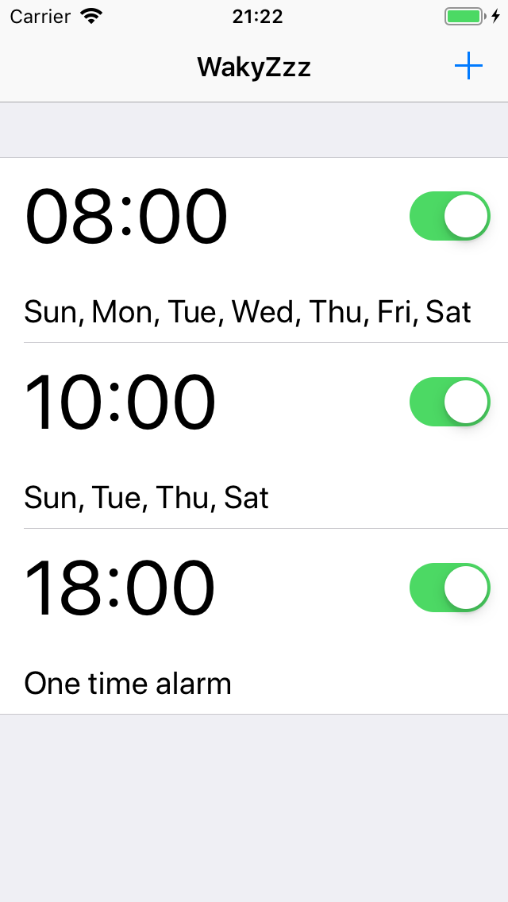

 

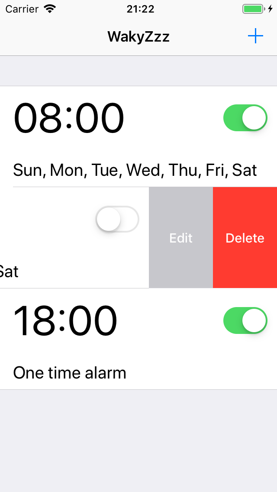

 

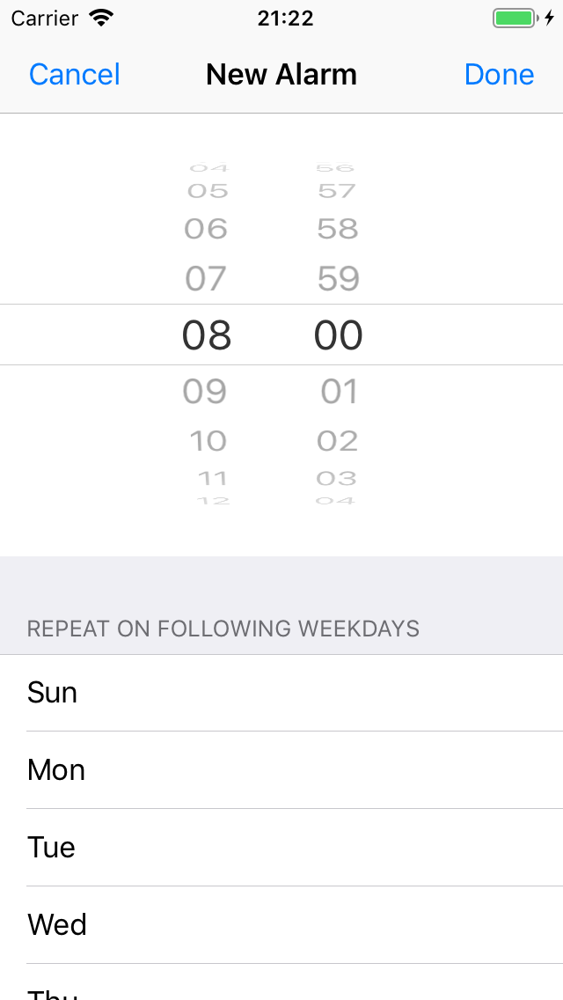

 

When the alarm goes off the user can snooze it. After one minute the alarm goes off again. 

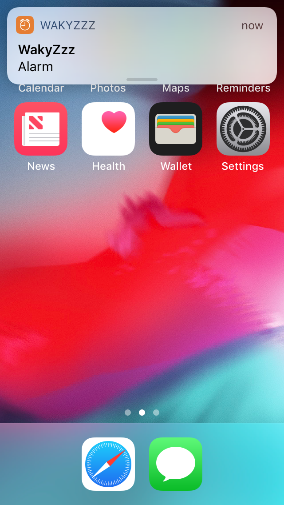
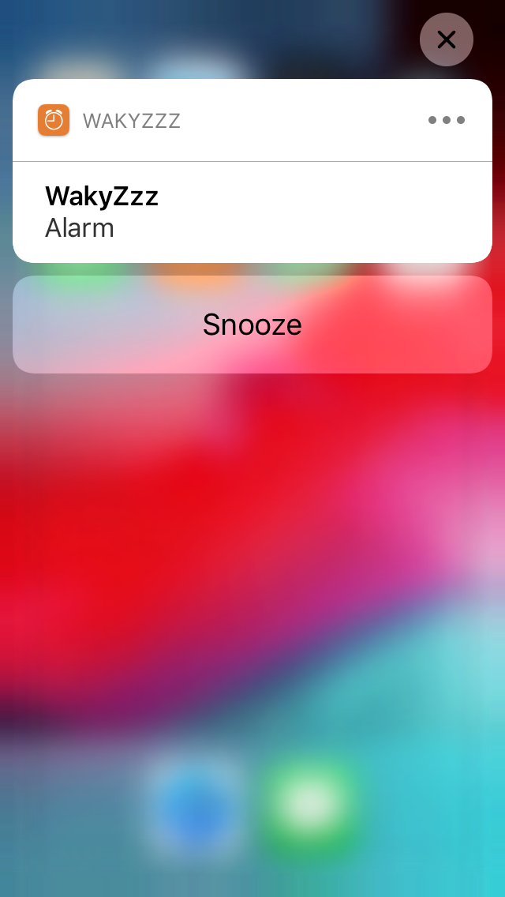

 

The second snooze will bring the app into the foreground and an <i><em>"evil"</em></i> sound will be played in an infinite loop. 
The user needs to select an act of kindness in order to stop this <i><em>"evil"</em></i> sound. 

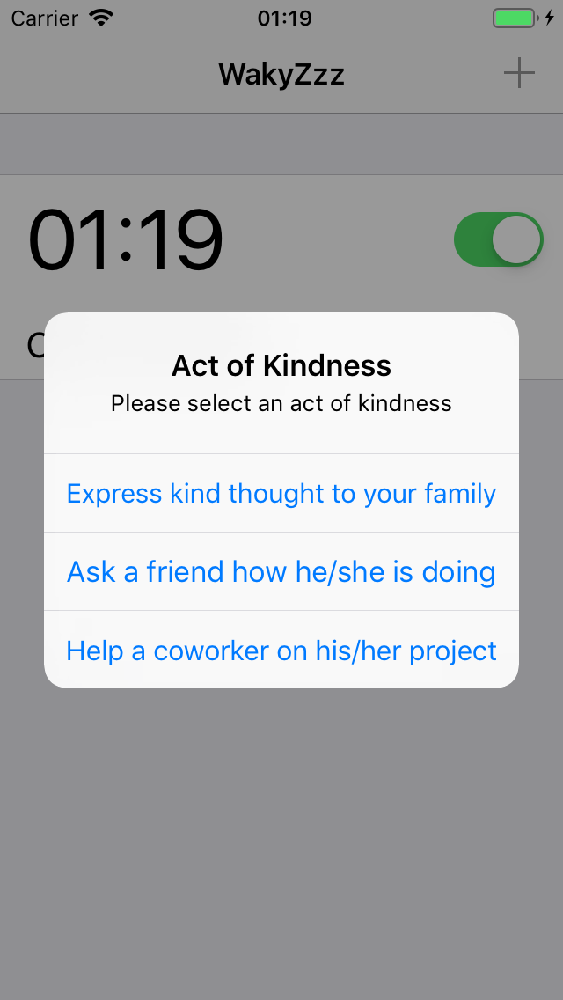

 

The user can delay his/her promise and can be reminded one hour later through user notification. 

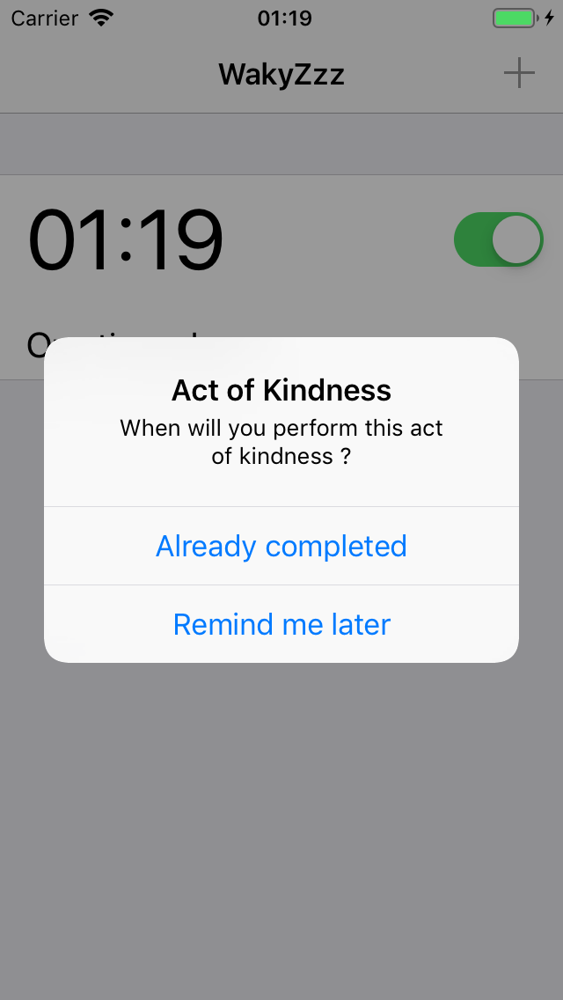
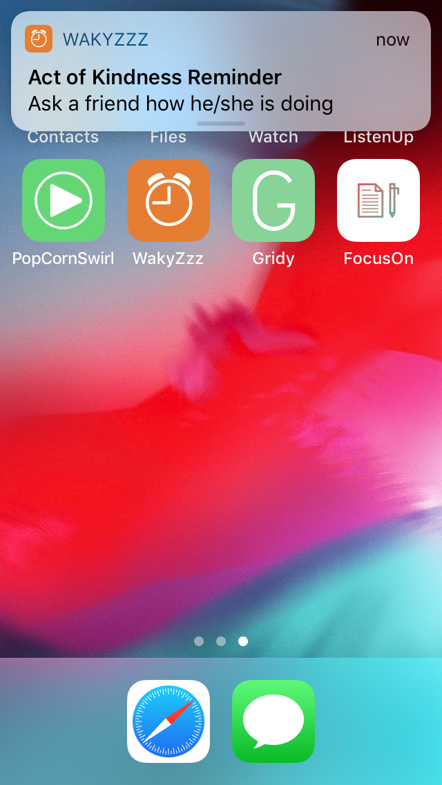
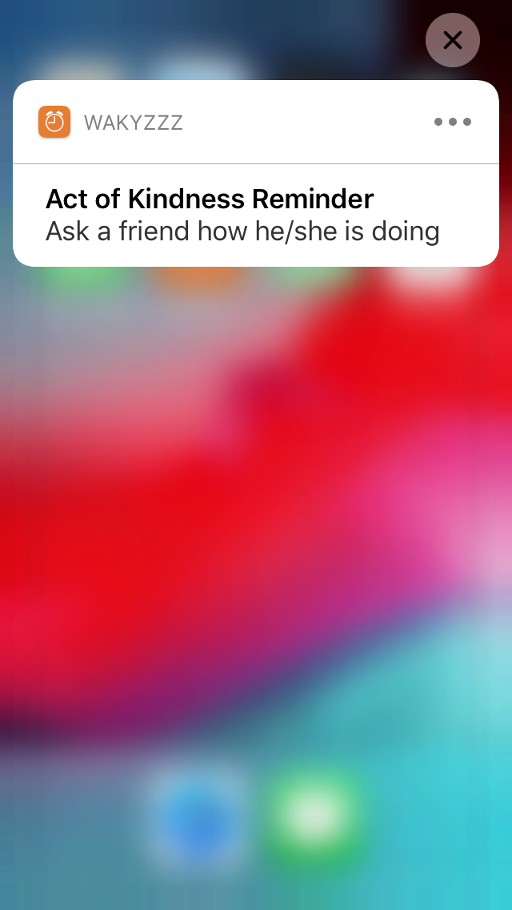

 

## Landscape

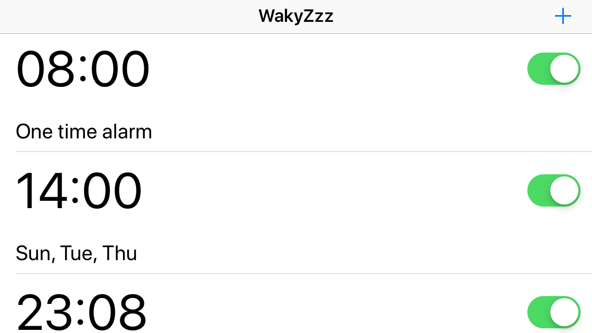

  

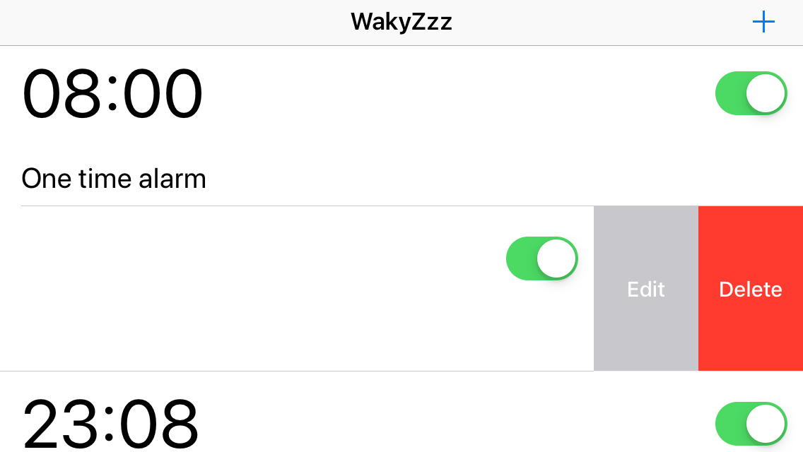

  

  
